# 🚀 DevOpsNotes : Blog Technique & Plateforme Communautaire

[ 🇫🇷 Version Française ](#-version-française) | [ 🇺🇸 English Version ](#-english-version)

---

## 🇫🇷 Version Française

### 📑 Sommaire
* [Architecture Cloud-Native](#-architecture-cloud-native)
* [Développement & Données](#-développement--données)
* [CI/CD & Automatisation](#-cicd--automatisation)
* [Télémétrie & SEO](#-télémétrie--seo)
* [Monitoring & Sécurité](#-monitoring--sécurité)
* [Installation Locale](#-installation--configuration-locale)
* [Compétences Validées](#-compétences-validées)

**DevOpsNotes** est une application Full-Stack "Cloud-Native" conçue pour illustrer les standards modernes du DevOps et de la SecOps orchestré par Kubernetes. Ce projet est un laboratoire d'architecture évolutive et automatisée, monitoré par Grafana et observé avec Sentry.

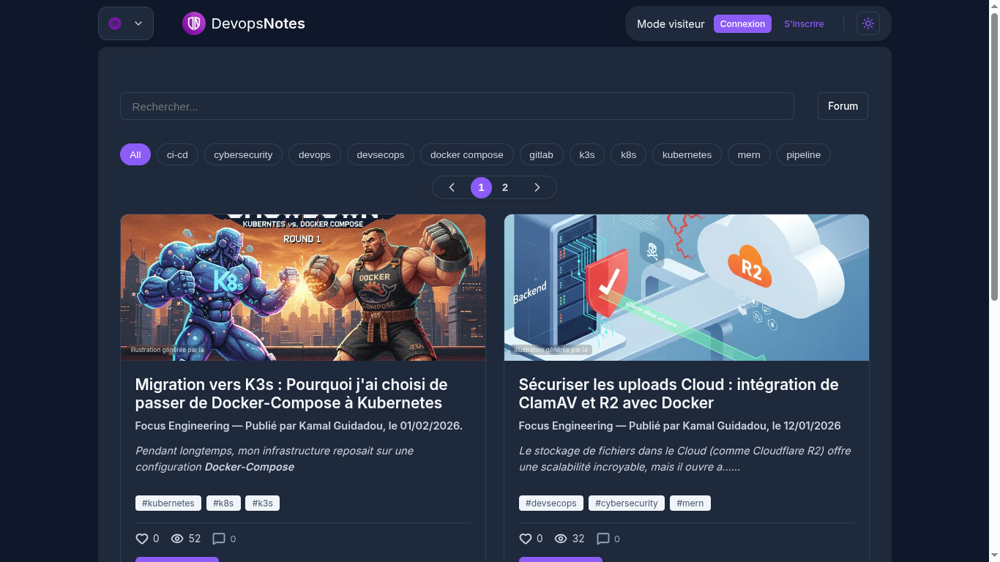

> **Note:** Ce projet a migré d'une configuration Docker Compose vers un cluster **Kubernetes (k3s)** afin de valider des compétences avancées en orchestration, résilience et scalabilité.

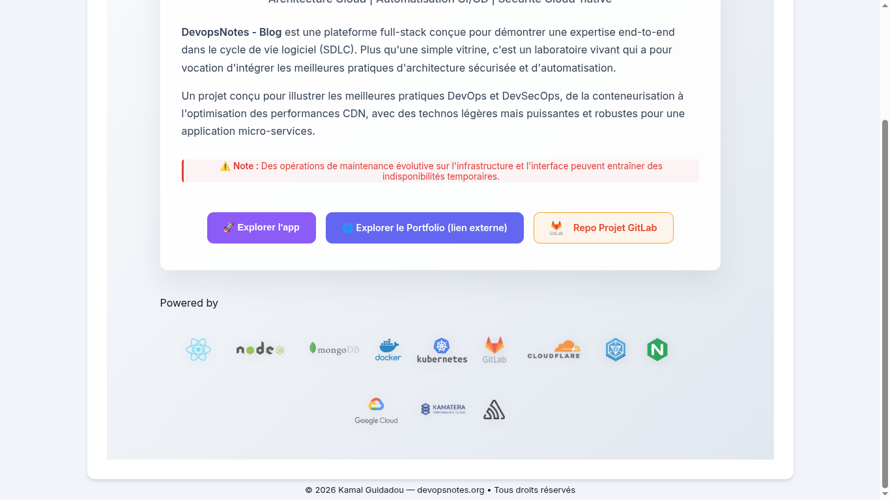

### 🏗️ Architecture Cloud-Native
Le projet repose sur une approche **stateless** et **hybride**, garantissant une haute disponibilité pour l'ensemble des services (`blog-devopsnotes`, `portfolio-portal` et `app-devopsnotes`).

* **Orchestration & Infrastructure** :
    * **Cluster k3s** : Distribution Kubernetes légère sur VPS Kamatera (Ubuntu Server).
    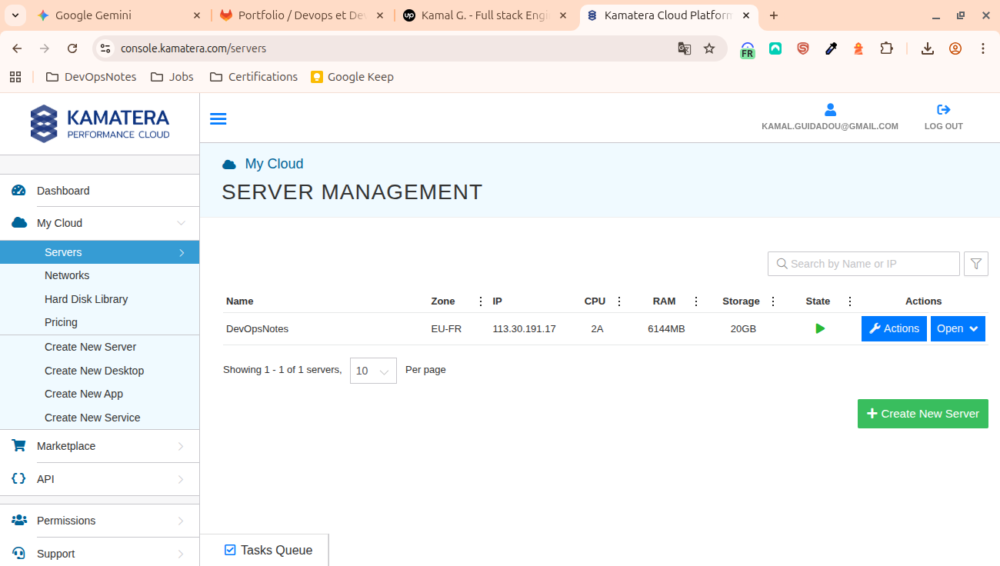
    * **Ingress Controller (Nginx)** : Contrôle granulaire du routage et terminaison TLS.
    * **Runtime** : Docker avec builds multi-stage.

* **Gestion des Données** :
    * **Persistance** : MongoDB Atlas (DaaS).
    * **Stockage Objet** : Migration intégrale vers **Cloudflare R2** (S3-Compatible).
    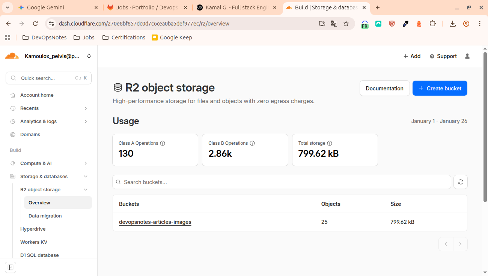

* **Edge & Sécurité** :
    * **Flux** : Sécurisé via Cloudflare (TLS 1.3 + WAF).
    * **Certificats** : Automatisation via Let's Encrypt.
    

### 💻 Développement & Données
* **Frontend** : React (TypeScript), React-Helmet-Async.
    
* **Backend** : Node.js / Express (TypeScript).
* **Communications** : API Resend (système de Double Opt-in).
    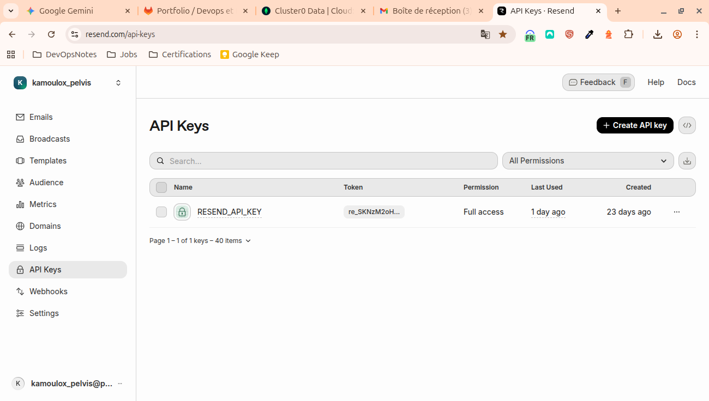

### ⚙️ CI/CD & Automatisation
* **Plateforme** : GitLab CI.
* **Workflow** : Builds auto, push registry et déploiement k3s via `CI_CD_SSH_KEY`.
    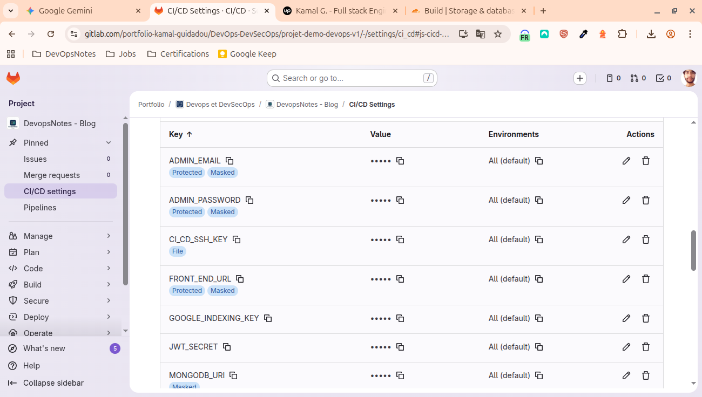
* **Stratégie** : Rolling updates (zero-downtime).

### 📈 Télémétrie & SEO (Stack LGO)
* **Error Tracking** : Sentry.io.
    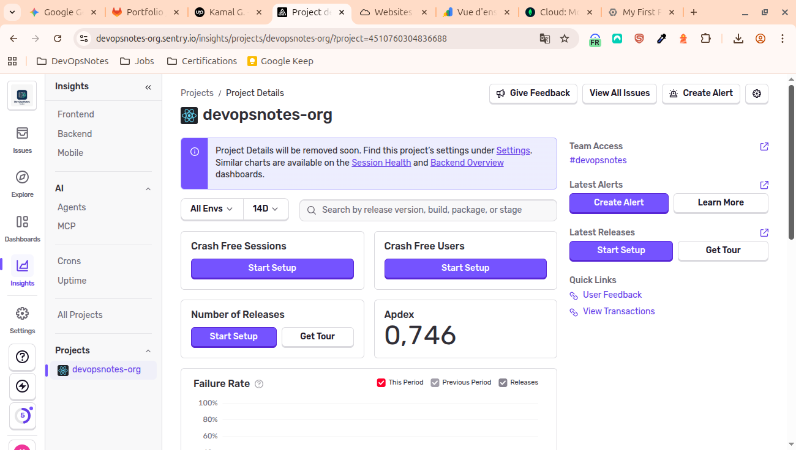
* **Web Analytics** : Umami (Privacy-first).
    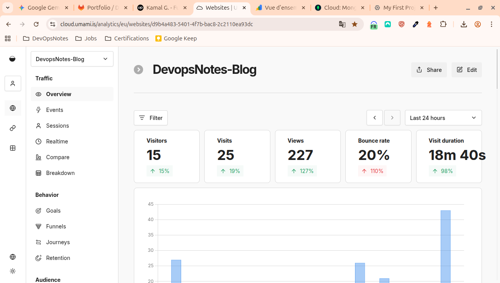
* **SEO Avancé** : Google Indexing API en temps réel.
    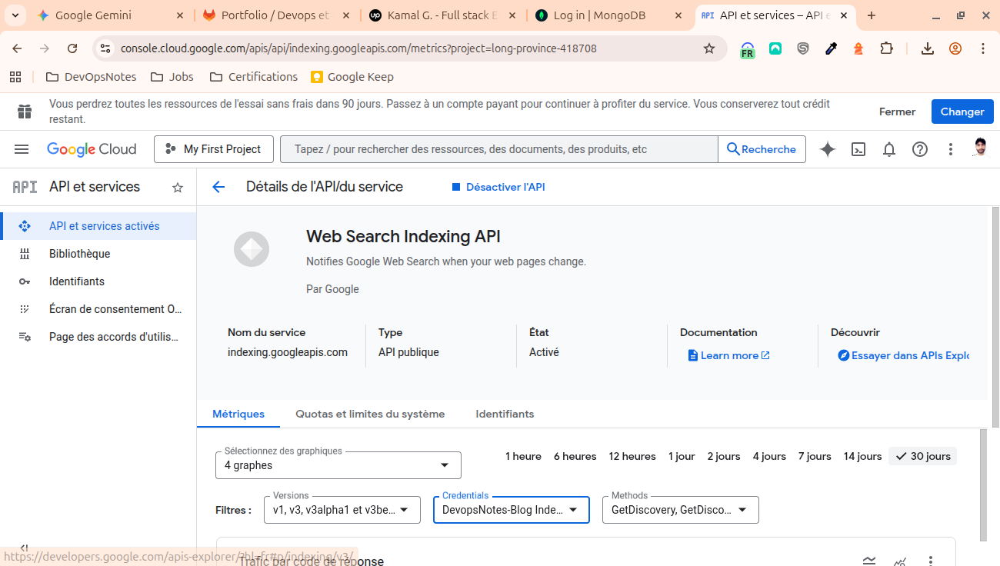
* **Benchmark** : Google LightHouse (Score 100/100).
    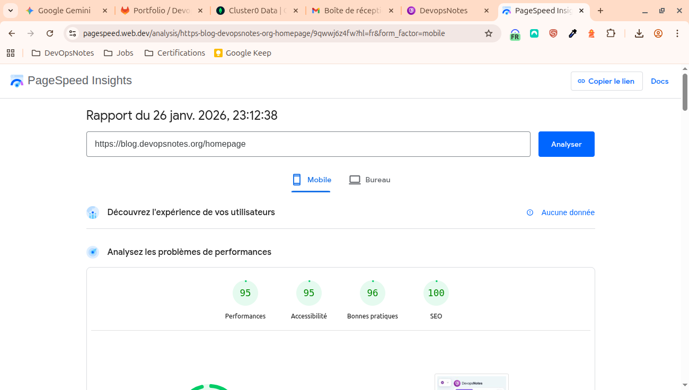

### 🛡️ Monitoring & Sécurité
**Monitoring** : Prometheus & Grafana :
* **Stack LGO** : Surveillance des "4 Golden Signals".
    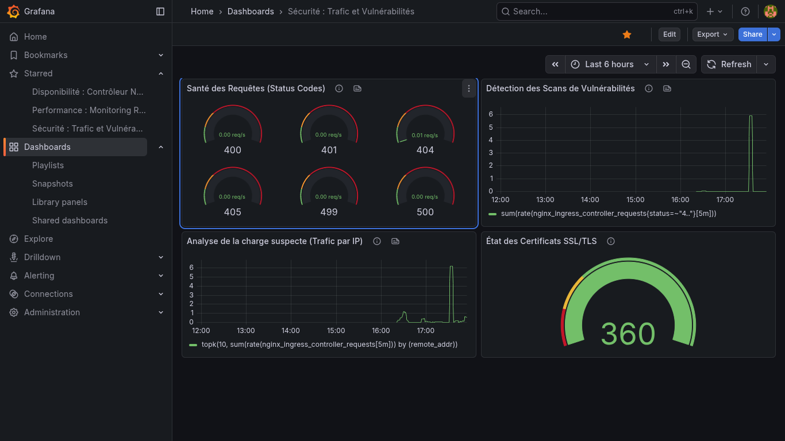
* **Analyse Forensique** : Détection d'intrusions via logs Ingress Nginx.
* **Fiabilité** : Routes de healthcheck automatisées (`/api/health`) et surveillance proactive du cycle de vie des certificats SSL.

## 🔧 Installation & Configuration Locale


```bash
git clone [https://gitlab.com/kamal/blog-devopsnotes.git](https://gitlab.com/kamal/blog-devopsnotes.git)
cd blog-devopsnotes

# 1. Installation de l'Ingress Controller Nginx
kubectl apply -f [https://raw.githubusercontent.com/kubernetes/ingress-nginx/controller-v1.8.2/deploy/static/provider/cloud/deploy.yaml](https://raw.githubusercontent.com/kubernetes/ingress-nginx/controller-v1.8.2/deploy/static/provider/cloud/deploy.yaml)

# 2. Création du Namespace dédié
kubectl create namespace devopsnotes-prod

# 3. Configuration des Secrets (Base de données, R2, Resend)

# Important : Ne poussez jamais vos fichiers .env. Créez le secret Kubernetes ainsi :
kubectl create secret generic app-secrets \
  --from-env-file=./backend/.env \
  -n devopsnotes-prod

# Application des manifests dans l'ordre (Config -> App -> Ingress)
kubectl apply -f ./k8s/deployments/ -n devopsnotes-prod
kubectl apply -f ./k8s/services/ -n devopsnotes-prod
kubectl apply -f ./k8s/ingress-nginx.yaml -n devopsnotes-prod


# Vérifier que tous les pods sont en état 'Running'
kubectl get pods -n devopsnotes-prod

# Récupérer l'adresse IP de l'Ingress
kubectl get ingress -n devopsnotes-prod
```

### 🎓 Compétences Validées

* **Orchestration Avancée** : Déploiement et gestion de cluster k3s avec Nginx Ingress.
* **Architecture Stateless** : Découplage du stockage (S3/R2) et de la donnée (DaaS).
* **Industrialisation** : Pipeline CI/CD complet vers un environnement Kubernetes.
* **Observabilité** : Mise en place d'une télémétrie avancée pour le monitoring et la sécurité.


Site et projet créés par Kamal Guidadou

Contact : [https://linkedin.com/in/-kamal.guidadou / 
Portfolio: https://portfolio.devopsnotes.org]


----------------------------------------------------------------------------------

<a name="english-version"></a>
🇺🇸 English Version 

# 🚀 DevOpsNotes: Technical Blog & Community Platform

### 📑 Summary
* [🏗️ Cloud-Native Architecture](#%EF%B8%8F-cloud-native-architecture--technical-stack)
* [💻 Development & Data](#2-development--data)
* [⚙️ CI/CD & Automation](#3-cicd--automation)
* [📈 Telemetry & SEO](#4-telemetry--seo-lgo-stack)
* [🛡️ Monitoring & Security](#5-%EF%B8%8F-monitoring--security)
* [🔧 Local Installation](#-local-installation--configuration)
* [🎓 Validated Engineering Skills](#-validated-engineering-skills)

**DevOpsNotes** is a 'Cloud-Native' Full-Stack application engineered to showcase modern DevOps and SecOps standards orchestrated by Kubernetes. This project serves as a laboratory for scalable and automated architectures, monitored through Grafana and observed with Sentry. It also functions as a community-driven blog and forum, providing a dedicated space for professionals to exchange insights on DevOps and Security subjects via integrated chat and discussion boards.

> **Note:** This project has migrated from a Docker Compose configuration to a **Kubernetes (k3s)** cluster to validate advanced skills in orchestration, resilience, and scalability.


### 🏗️ Cloud-Native Architecture & Technical Stack

The project follows a **stateless** and **hybrid** approach, ensuring high availability for all services: `blog-devopsnotes`, `portfolio-portal`, and `app-devopsnotes`.

* **Orchestration & Infrastructure**:
    * **k3s Cluster**: Lightweight Kubernetes distribution managing the pod lifecycle on a Kamatera VPS (Ubuntu Server).


    * **Ingress Controller (Nginx)**: Implemented instead of Traefik for granular routing control, URL rewrites, and TLS termination.
    * **Runtime**: Docker with multi-stage builds to optimize security and image size.

* **Data Management (Stateless Architecture)**:
    * **Persistence**: MongoDB Atlas (DaaS) for a managed and resilient database.
    * **Object Storage**: Full media migration to **Cloudflare R2** (S3-Compatible), making the applications completely independent of local disk storage.


* **Edge, Networking & Security**:
    * **Traffic Flow**: Secured via Cloudflare (TLS 1.3 + WAF).
    * **Certificates**: Automated SSL/TLS certificate management via Let's Encrypt at the cluster level.


### 2. Development & Data
* **Frontend:** React (TypeScript), React-Helmet-Async.


* **Backend:** Node.js / Express (TypeScript).
* **Database:** MongoDB Atlas.
* **Object Storage:** Cloudflare R2 (S3-Compatible).
* **Communications:** Resend API (Double Opt-in system).


### 3. CI/CD & Automation
* **Platform:** GitLab CI.
* **Workflow:** Automated builds, container registry push, and automated deployment to k3s using the `CI_CD_SSH_KEY`.


* **Strategy:** Rolling updates for zero-downtime deployments.

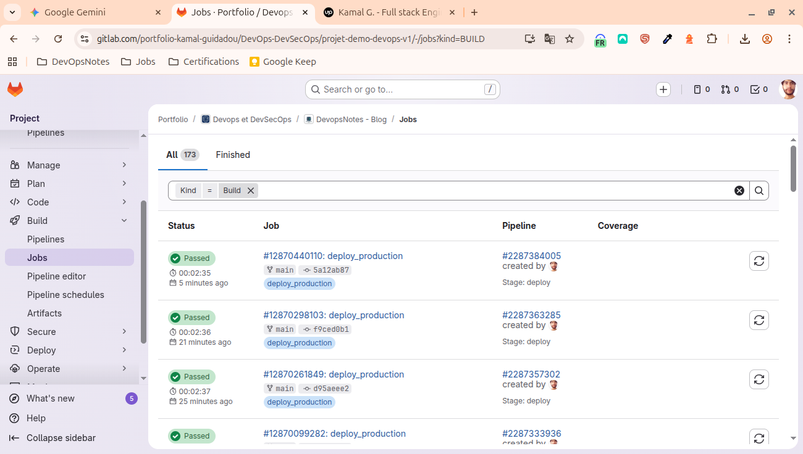

### 4. Telemetry & SEO (LGO Stack)
* **Error Tracking:** Sentry.io (Full-stack with Source Maps support).


* **Web Analytics:** Umami (Privacy-first & Self-hosted).


* **Advanced SEO:** Google Indexing API for real-time article indexing.


* **Performance & SEO benchmark**: Google LightHouse.


### 5. 🛡️ Monitoring & Security

The infrastructure integrates a monitoring suite native to the Kubernetes ecosystem for total production control.

**Monitoring**: Prometheus & Grafana :
* **LGO Stack:** Real-time monitoring of cluster resources and the "4 Golden Signals".


* **Forensic Analysis:** Intrusion detection and vulnerability scanning through Nginx Ingress log analysis.
* **Reliability:** Automated healthcheck routes (`/api/health`) and proactive SSL certificate lifecycle monitoring.

## 🔧 Local Installation & Configuration

```bash
# Clone the repository
git clone [https://gitlab.com/kamal/blog-devopsnotes.git](https://gitlab.com/kamal/blog-devopsnotes.git)
cd blog-devopsnotes

# 1. Install Nginx Ingress Controller
kubectl apply -f [https://raw.githubusercontent.com/kubernetes/ingress-nginx/controller-v1.8.2/deploy/static/provider/cloud/deploy.yaml](https://raw.githubusercontent.com/kubernetes/ingress-nginx/controller-v1.8.2/deploy/static/provider/cloud/deploy.yaml)

# 2. Create the dedicated Namespace
kubectl create namespace devopsnotes-prod

# 3. Configure Secrets (Database, R2, Resend)
# Important: Never push your .env files. Create the Kubernetes secret as follows:
kubectl create secret generic app-secrets \
  --from-env-file=./backend/.env \
  -n devopsnotes-prod

# 4. Deploy manifests in order (Config -> App -> Ingress)
kubectl apply -f ./k8s/deployments/ -n devopsnotes-prod
kubectl apply -f ./k8s/services/ -n devopsnotes-prod
kubectl apply -f ./k8s/ingress-nginx.yaml -n devopsnotes-prod

# 5. Verify that all pods are in 'Running' state
kubectl get pods -n devopsnotes-prod

# 6. Retrieve the Ingress IP address
kubectl get ingress -n devopsnotes-prod
```

## 🎓 Validated Engineering Skills

* **Advanced Orchestration:** Deploying and managing a k3s cluster with Nginx Ingress.
* **Stateless Architecture:** Total decoupling of storage (S3/R2) and data (DaaS).
* **Industrialization:** Complete CI/CD pipeline targeting a Kubernetes environment.
* **Performance:** Achieving a 100/100 Lighthouse score through CDN offloading and Sharp image optimization.


Created by **Kamal Guidadou**

**Contact:** [https://linkedin/in/kamal-guidadou / 
https://portfolio.devopsnotes.org]

