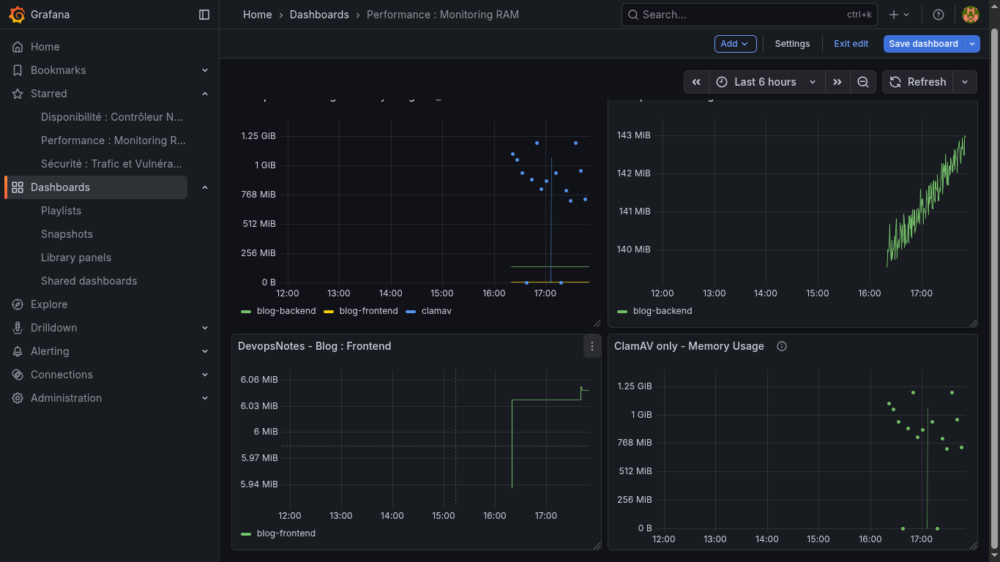

🚀 DevOpsNotes : Blog Technique & Plateforme Community

DevOpsNotes est une application Full-Stack moderne conçue pour démontrer la mise en œuvre d'une architecture Cloud-Native, sécurisée et entièrement automatisée.

Ce projet dépasse le simple cadre d'un blog pour explorer des problématiques réelles de production : Stockage S3-compatible, Pipeline CI/CD, Optimisation Web (Lighthouse) et Sécurité SSL/TLS.

🛠️ Stack Technique

Frontend & Performance
- Framework : React (TypeScript)
- UI/UX : Design responsive, gestion dynamique des états de connexion.
- Optimisation : Score Lighthouse de 100/100 en performance grâce au déchargement des médias vers un CDN.

Backend & API
- Runtime : Node.js / Express avec TypeScript.
- Auth : Authentification JWT, gestion des rôles (Admin/Membre), validation d'email via Resend.
- Base de données : MongoDB Atlas (DaaS).

Infrastructure & DevOps (Le cœur du projet)
- Conteneurisation : Docker & Docker Compose (Builds multi-stage optimisés) vers VPS via :
- CI/CD : Pipeline GitLab CI automatisé avec déploiement continu sur VPS (Kamatera).
- Stockage Cloud (Object Storage) : Migration des uploads locaux vers Cloudflare R2 (S3-Compatible) avec Custom Domain.

Réseau & Sécurité :
- Reverse Proxy Nginx.
- Certificats SSL/TLS via Let's Encrypt.
- Protection & DNS : Cloudflare (Mode Full Strict).
- Gestion du cache via Cloudflare Cache Rules.

🏗️ Architecture & Flux de Données

1. Client → Requête via HTTPS (TLS 1.3) → Cloudflare.

2. Cloudflare → Gère le cache des images et redirige le trafic vers le VPS.

3. VPS (Nginx) → Dispatch le trafic vers les containers Frontend ou Backend.

4. Backend →

  - Interagit avec MongoDB Atlas pour les données.
  - Utilise Resend pour les emails transactionnels (vérification de compte).
  - Communique avec Cloudflare R2 pour uploader/servir les médias.

🔧 Fonctionnalités Avancées

- Système de Forum & Interaction : Création de fils de discussion, réponses, et profils membres avec avatars.
- Sécurité Anti-Bot : Validation stricte des comptes par email (Double Opt-in).
- Stockage Déporté (Stateless) : L'application est désormais "stateless". Les images ne sont plus stockées sur le disque du serveur mais sur un bucket R2, permettant une scalabilité horizontale facilitée.
- Supervision : Route de healthcheck (/api/health) intégrée.

📈 DevOps : Automatisation & Qualité

  - Pipeline CI/CD (GitLab)
Le projet intègre un pipeline complet défini dans .gitlab-ci.yml :

  - Build : Vérification de la compilation TypeScript.
  - Deploy : Déploiement automatique par SSH sur le VPS, mise à jour des images Docker et redémarrage des services sans interruption de service (Zero-downtime-like).

- Web Performance & CDN
L'utilisation d'un domaine personnalisé pour R2 (resources.devopsnotes.org) permet :

  - Une réduction drastique de la charge serveur (CPU/RAM).
  - Une mise en cache agressive au niveau du Edge (serveurs Cloudflare au plus proche de l'utilisateur).
  - Un gain de performance mesuré par Lighthouse (SEO-friendly).

- Observabilité au Build : Injection de SENTRY_AUTH_TOKEN lors de l'étape de construction Docker pour garantir la traçabilité des versions déployées.

🚀 Installation & Lancement (Local)

1. Clonage du projet :

Bash

git clone https://gitlab.com/votre-repo/devopsnotes.git
cd devopsnotes

2. Configuration : Créez un fichier .env dans /backend et /frontend en vous basant sur les exemples fournis (incluant vos clés R2, Resend, et MongoDB).

3. Lancement via Docker Compose :

Bash

docker compose up -d --build
Accès :

Frontend : http://localhost:3000

API : http://localhost:5000/api

🎓 Objectifs Pédagogiques Atteints

- Maîtrise du cycle de vie complet d'un logiciel (SDLC).
- Capacité à migrer une infrastructure locale vers une architecture hybride Cloud.
- Mise en œuvre de bonnes pratiques de sécurité (Secrets, TLS, filtrage CORS).
- Optimisation des ressources système et des performances frontend.

### 📊 Observabilité & Télémétrie (MAJ DU 23 JANVIER 2026)
Pour garantir la fiabilité et la performance en production, le projet intègre une stack de monitoring moderne :

- **Error Tracking (Sentry)** : 
  - Monitoring Full-Stack : Capture automatique des exceptions Backend (Express) et erreurs Runtime Frontend (React).
  - **Gestion des Source Maps** : Pipeline CI/CD automatisé pour l'injection et l'upload des artifacts de débogage vers Sentry, permettant une lecture du code source original (TSX) sur les erreurs minifiées.
  - **Performance Monitoring** : Suivi des transactions et profiling des ressources pour identifier les goulots d'étranglement.

- **Analytics Privacy-First (Umami)** : Suivi du trafic et de l'engagement utilisateur sans cookies, conforme RGPD et auto-hébergé pour une maîtrise totale des données.

- **SEO & Indexation** : Génération dynamique de sitemaps XML via API pour assurer une visibilité maximale sur les moteurs de recherche.

## 🚀 SEO & Visibility : Améliorations du SEO (25 janvier 2026)

Pour garantir une visibilité maximale et une indexation en temps réel, le projet intègre une stratégie SEO avancée :

### 1. Indexation Automatisée (Real-time)

* **Google Indexing API** : Intégration d'un service backend (`googleIndexingService.ts`) qui notifie Google instantanément via un compte de service dès qu'un article est créé ou modifié. Cela réduit le temps d'indexation de plusieurs jours à quelques minutes.

* **Architecture asynchrone** : Les notifications sont envoyées en arrière-plan pour ne pas impacter la performance de l'interface d'administration.

### 2. Structure & Métadonnées
* **Sitemap Dynamique** : Génération automatisée d'un `sitemap.xml` propre au sous-domaine `blog.devopsnotes.org`.
* **Gestion du Head (React 19)** : Utilisation de `react-helmet-async` pour l'injection dynamique :
    * Des **balises canoniques** pour éviter le "duplicate content" entre le domaine racine et le sous-domaine.
    * Des balises **Open Graph** pour optimiser l'affichage lors des partages sur LinkedIn, Twitter, etc.
    * Des titres et descriptions uniques par article pour améliorer le taux de clic (CTR).

## 🛡️ Observabilité & Sécurité (LGO Stack)

L'infrastructure intègre une suite de monitoring avancée basée sur **Prometheus** et **Grafana**, spécifiquement configurée pour la surveillance de la sécurité et du trafic réseau.

### 📊 Dashboard de Surveillance du Trafic

*Visualisation en temps réel de la santé des requêtes, de la détection de scans et de la conformité TLS.*

### 🚀 Capacités d'Ingénierie implémentées :

* **Détection d'Intrusions (IDS Visuel)** : Corrélation immédiate entre les pics d'erreurs HTTP (4xx/5xx) et les adresses IP sources via des requêtes PromQL complexes (`topk`, `rate`).
* **Analyse Forensique** : Capacité d'isoler des comportements suspects, comme les scans de vulnérabilités (illustré ci-dessus par un pic de 1.4 req/s sur une IP unique).
* **Gestion de la Conformité TLS** : Monitoring automatisé du cycle de vie des certificats via Ingress Nginx, avec visualisation du temps restant en pourcentage pour garantir un renouvellement proactif.
* **Golden Signals** : Surveillance des 4 signaux d'or (Latence, Trafic, Erreurs, Saturation) pour assurer la haute disponibilité de `blog-devopsnotes`.

