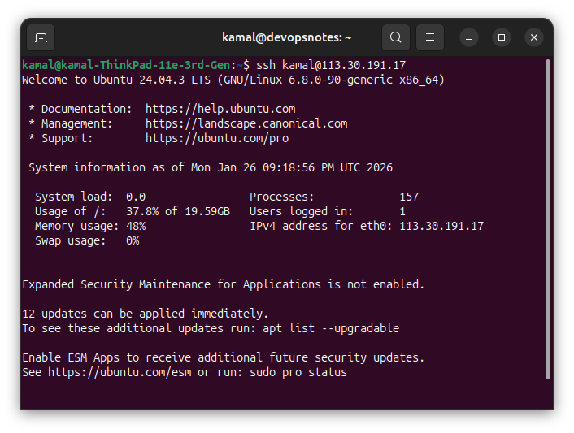

[ 🇫🇷 Français ](#version-francaise) | [ 🇺🇸 English ](#english-version)

---

### 🇫🇷 Version Française<a name="version-francaise"></a>

# 🚀 DevOpsNotes : Blog Technique & Plateforme Communautaire

**DevOpsNotes** est une application Full-Stack moderne conçue pour démontrer la mise en œuvre d'une architecture Cloud-Native, sécurisée et entièrement orchestrée. Le choix du contenu de l'application (articles + forum + chat) est non seulement un exercice de style mais aussi la vocation d'en faire un réel blog communautaire.


> **Note:** Ce projet a migré d'une configuration Docker Compose vers un cluster **Kubernetes (k3s)** afin de valider des compétences avancées en orchestration, résilience et scalabilité.


### 🏗️ Architecture Cloud-Native

Le projet repose sur une approche **stateless** et **hybride**, garantissant une haute disponibilité pour l'ensemble des services (`blog-devopsnotes`, `portfolio-portal` et `app-devopsnotes`).

* **Orchestration & Infrastructure** :
    * **Cluster k3s** : Distribution Kubernetes légère pilotant le cycle de vie des pods sur un VPS Kamatera (Ubuntu Server).


    * **Ingress Controller (Nginx)** : Utilisé à la place de Traefik pour un contrôle granulaire du routage, des réécritures d'URL et de la terminaison TLS.
    * **Runtime** : Docker avec des builds multi-stage pour optimiser la sécurité et la taille des images.

* **Gestion des Données (Architecture Stateless)** :
    * **Persistance** : MongoDB Atlas (DaaS) pour une base de données managée et résiliente.
    * **Stockage Objet** : Migration intégrale des médias vers **Cloudflare R2** (S3-Compatible), rendant les applications totalement indépendantes du stockage disque local.


* **Edge, Réseau & Sécurité** :
    * **Flux de trafic** : Sécurisé via Cloudflare (TLS 1.3 + WAF).
    * **Certificats** : Gestion automatisée des certificats SSL/TLS via Let's Encrypt directement au niveau du cluster.





### Développement & Données
* **Frontend** : React (TypeScript), React-Helmet-Async.


* **Backend** : Node.js / Express (TypeScript).
* **Base de données** : MongoDB Atlas.
* **Object Storage** : Cloudflare R2 (S3-Compatible).
* **Communications** : API Resend (système de Double Opt-in).


### CI/CD & Automatisation
* **Plateforme** : GitLab CI.
* **Workflow** : Builds automatisés, push vers registre de conteneurs et déploiement automatisé sur k3s via la clé `CI_CD_SSH_KEY`.


* **Stratégie** : Rolling updates pour des déploiements sans interruption de service (zero-downtime).

### Télémétrie & SEO (Stack LGO)
* **Error Tracking** : Sentry.io (Full-stack avec support des Source Maps).


* **Web Analytics** : Umami (Respect de la vie privée & auto-hébergé).


* **SEO Avancé** : Google Indexing API pour une indexation des articles en temps réel.


* **Benchmark Performances et SEO** : Google LightHouse.


### 🛡️ Monitoring & Sécurité
L'infrastructure intègre une suite de monitoring native à l'écosystème Kubernetes pour un contrôle total de la production.

**Monitoring** : Prometheus & Grafana :
* **Stack LGO** : Surveillance en temps réel des ressources du cluster et des "4 Golden Signals".


* **Analyse Forensique** : Détection d'intrusions et scan de vulnérabilités via l'analyse des logs de l'Ingress Nginx.
* **Fiabilité** : Routes de healthcheck automatisées (`/api/health`) et surveillance proactive du cycle de vie des certificats SSL.

## 🔧 Installation & Configuration Locale


```bash
git clone [https://gitlab.com/kamal/blog-devopsnotes.git](https://gitlab.com/kamal/blog-devopsnotes.git)
cd blog-devopsnotes

# 1. Installation de l'Ingress Controller Nginx
kubectl apply -f [https://raw.githubusercontent.com/kubernetes/ingress-nginx/controller-v1.8.2/deploy/static/provider/cloud/deploy.yaml](https://raw.githubusercontent.com/kubernetes/ingress-nginx/controller-v1.8.2/deploy/static/provider/cloud/deploy.yaml)

# 2. Création du Namespace dédié
kubectl create namespace devopsnotes-prod

# 3. Configuration des Secrets (Base de données, R2, Resend)

# Important : Ne poussez jamais vos fichiers .env. Créez le secret Kubernetes ainsi :
kubectl create secret generic app-secrets \
  --from-env-file=./backend/.env \
  -n devopsnotes-prod

# Application des manifests dans l'ordre (Config -> App -> Ingress)
kubectl apply -f ./k8s/deployments/ -n devopsnotes-prod
kubectl apply -f ./k8s/services/ -n devopsnotes-prod
kubectl apply -f ./k8s/ingress-nginx.yaml -n devopsnotes-prod


# Vérifier que tous les pods sont en état 'Running'
kubectl get pods -n devopsnotes-prod

# Récupérer l'adresse IP de l'Ingress
kubectl get ingress -n devopsnotes-prod
```

### 🎓 Compétences Validées

* **Orchestration Avancée** : Déploiement et gestion de cluster k3s avec Nginx Ingress.
* **Architecture Stateless** : Découplage du stockage (S3/R2) et de la donnée (DaaS).
* **Industrialisation** : Pipeline CI/CD complet vers un environnement Kubernetes.
* **Observabilité** : Mise en place d'une télémétrie avancée pour le monitoring et la sécurité.


Site et projet créés par Kamal Guidadou

Contact : [https://linkedin.com/in/-kamal.guidadou / 
Portfolio: https://portfolio.devopsnotes.org]


----------------------------------------------------------------------------------

### 🇺🇸 English Version <a name="english-version"></a> 

# 🚀 DevOpsNotes: Technical Blog & Community Platform

**DevOpsNotes** is a modern Full-Stack application designed to demonstrate the implementation of a Cloud-Native, secure, and fully orchestrated architecture. The choice of application content (articles + forum + chat) is not only a technical exercise but also aims to serve as a genuine community blog.

> **Note:** This project has migrated from a Docker Compose configuration to a **Kubernetes (k3s)** cluster to validate advanced skills in orchestration, resilience, and scalability."


### 🏗️ Cloud-Native Architecture & Technical Stack

The project follows a **stateless** and **hybrid** approach, ensuring high availability for all services: `blog-devopsnotes`, `portfolio-portal`, and `app-devopsnotes`.

* **Orchestration & Infrastructure**:
    * **k3s Cluster**: Lightweight Kubernetes distribution managing the pod lifecycle on a Kamatera VPS (Ubuntu Server).


    * **Ingress Controller (Nginx)**: Implemented instead of Traefik for granular routing control, URL rewrites, and TLS termination.
    * **Runtime**: Docker with multi-stage builds to optimize security and image size.

* **Data Management (Stateless Architecture)**:
    * **Persistence**: MongoDB Atlas (DaaS) for a managed and resilient database.
    * **Object Storage**: Full media migration to **Cloudflare R2** (S3-Compatible), making the applications completely independent of local disk storage.


* **Edge, Networking & Security**:
    * **Traffic Flow**: Secured via Cloudflare (TLS 1.3 + WAF).
    * **Certificates**: Automated SSL/TLS certificate management via Let's Encrypt at the cluster level.


### 2. Development & Data
* **Frontend:** React (TypeScript), React-Helmet-Async.


* **Backend:** Node.js / Express (TypeScript).
* **Database:** MongoDB Atlas.
* **Object Storage:** Cloudflare R2 (S3-Compatible).
* **Communications:** Resend API (Double Opt-in system).


### 3. CI/CD & Automation
* **Platform:** GitLab CI.
* **Workflow:** Automated builds, container registry push, and automated deployment to k3s using the CI_CD_SSH_KEY.


* **Strategy:** Rolling updates for zero-downtime deployments.


### 4. Telemetry & SEO (LGO Stack)
* **Error Tracking:** Sentry.io (Full-stack with Source Maps support).


* **Web Analytics:** Umami (Privacy-first & Self-hosted).


* **Advanced SEO:** Google Indexing API for real-time article indexing.


* **Performance & SEO benchmark** Google LightHouse


### 5. 🛡️ Monitoring & Security

The infrastructure integrates a monitoring suite native to the Kubernetes ecosystem for total production control.

**Monitoring** : Prometheus & Grafana :
* **LGO Stack:** Real-time monitoring of cluster resources and the "4 Golden Signals".


* **Forensic Analysis:** Intrusion detection and vulnerability scanning through Nginx Ingress log analysis.
* **Reliability:** Automated healthcheck routes (/api/health) and proactive SSL certificate lifecycle monitoring.

## 🔧 Local Installation & Configuration

```bash
# Clone the repository
git clone [https://gitlab.com/kamal/blog-devopsnotes.git](https://gitlab.com/kamal/blog-devopsnotes.git)
cd blog-devopsnotes

# 1. Install Nginx Ingress Controller
kubectl apply -f [https://raw.githubusercontent.com/kubernetes/ingress-nginx/controller-v1.8.2/deploy/static/provider/cloud/deploy.yaml](https://raw.githubusercontent.com/kubernetes/ingress-nginx/controller-v1.8.2/deploy/static/provider/cloud/deploy.yaml)

# 2. Create the dedicated Namespace
kubectl create namespace devopsnotes-prod

# 3. Configure Secrets (Database, R2, Resend)
# Important: Never push your .env files. Create the Kubernetes secret as follows:
kubectl create secret generic app-secrets \
  --from-env-file=./backend/.env \
  -n devopsnotes-prod

# 4. Deploy manifests in order (Config -> App -> Ingress)
kubectl apply -f ./k8s/deployments/ -n devopsnotes-prod
kubectl apply -f ./k8s/services/ -n devopsnotes-prod
kubectl apply -f ./k8s/ingress-nginx.yaml -n devopsnotes-prod

# 5. Verify that all pods are in 'Running' state
kubectl get pods -n devopsnotes-prod

# 6. Retrieve the Ingress IP address
kubectl get ingress -n devopsnotes-prod
```

## 🎓 Validated Engineering Skills

* **Advanced Orchestration:** Deploying and managing a k3s cluster with Nginx Ingress.
* **Stateless Architecture:** Total decoupling of storage (S3/R2) and data (DaaS).
* **Industrialization:** Complete CI/CD pipeline targeting a Kubernetes environment.
* **Performance:** Achieving a 100/100 Lighthouse score through CDN offloading and Sharp image optimization.


Created by **Kamal Guidadou**

**Contact:** [https://linkedin/in/kamal-guidadou / 
https://portfolio.devopsnotes.org]

----------------------------------------------------------------------------------


